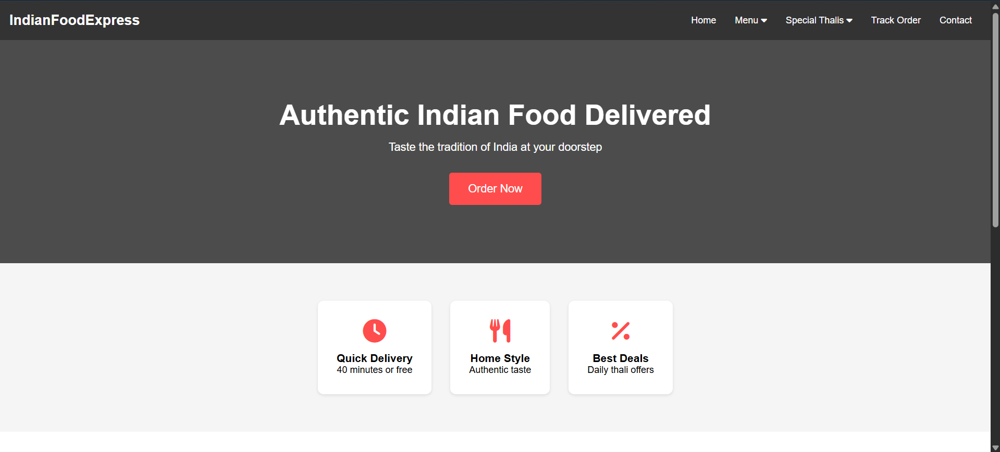
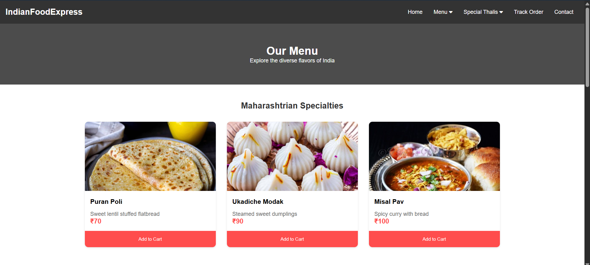
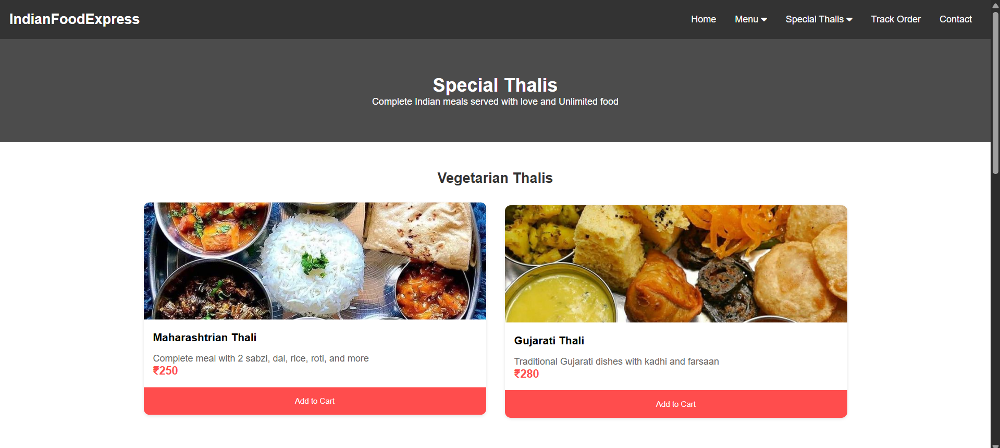

# Indian Food Express - Food Delivery Website

A responsive food delivery website specializing in authentic Indian cuisine, built with HTML and CSS.

## 🚀 Live Demo
[View Live Demo](https://nirajshevade.github.io/Indian-Food-Express/)

## 📸 Screenshots

## ✨ Features

- Fully responsive design that works on desktop and mobile devices
- Clean and modern user interface
- Interactive navigation with dropdown menus
- Dedicated sections for:
  - Popular menu items
  - Special thalis
  - Order tracking
  - Shopping cart
  - Contact form

## 🛠️ Technologies Used

- HTML5
- CSS3
- Font Awesome Icons
- Google Fonts

## 📁 File Structure

│
├── index.html # Homepage
├── menu.html # Menu page with all food items
├── thalis.html # Special thalis page
├── cart.html # Shopping cart
├── track-order.html # Order tracking page
├── contact.html # Contact form page
│
├── styles.css # Main stylesheet
│
└── ...

3. Open `index.html` in your web browser to view the website.

## 💻 Local Development

To work on this project locally:
1. Make sure you have a modern web browser installed
2. Use a local development server (like Live Server in VS Code) for the best development experience
3. Edit the HTML and CSS files as needed
4. Images can be replaced in the `images` folder

## 📱 Responsive Design

The website is fully responsive and includes:
- Mobile-friendly navigation
- Flexible grid layouts
- Responsive images
- Adaptive typography
- Touch-friendly buttons and links

## 🎨 Color Scheme

- Primary Color: `#ff4d4d`
- Secondary Color: `#333333`
- Background Color: `#f5f5f5`
- Text Color: `#333333`
- Accent Color: `#ff3333`

## 🔮 Future Enhancements

- [ ] Add JavaScript functionality for cart operations
- [ ] Implement user authentication
- [ ] Add payment gateway integration
- [ ] Create admin dashboard
- [ ] Add real-time order tracking
- [ ] Implement search functionality

## 🤝 Contributing

Contributions are welcome! Please feel free to submit a Pull Request.

1. Fork the repository
2. Create your feature branch (`git checkout -b feature/AmazingFeature`)
3. Commit your changes (`git commit -m 'Add some AmazingFeature'`)
4. Push to the branch (`git push origin feature/AmazingFeature`)
5. Open a Pull Request

## 👥 Author

Niraj Shevade - [nirajshevade](https://github.com/nirajshevade)

## 🙏 Acknowledgments

- Font Awesome for icons
- Images sourced from [pinterest]
- Inspiration from various Indian restaurants

## 📞 Contact

For any queries or suggestions, please reach out to:
- Email: niraj.shevade@aissmsioit.org
- LinkedIn: [niraj-shevade](https://www.linkedin.com/in/niraj-shevade-3113b8290/)

---
⭐️ Star this repo if you find it helpful!
